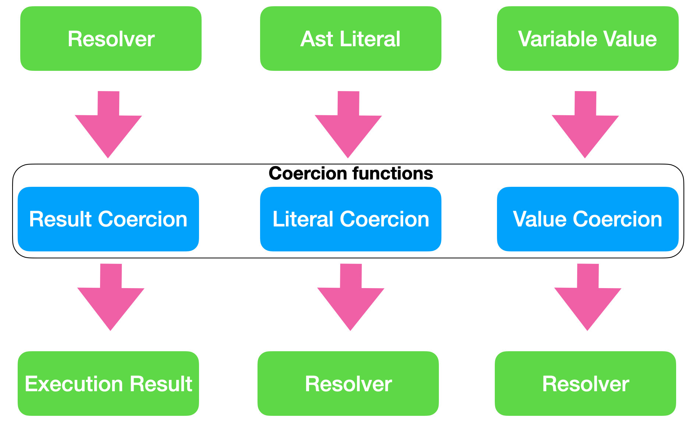

import { Link } from 'gatsby'
import Layout from '../components/layout'
import SEO from '../components/seo'

<SEO title="Guide to GraphQL Scalars" />

<h1>Reference guide to implement custom GraphQL Scalars</h1>

This is a reference which aims to be as complete as possible, for an introduction see: [GraphQL Scalars in-depth](https://www.graphql.de/blog/scalars-in-depth/)

```toc
# This code block gets replaced with the TOC
```


# Coercion functions

The fundamental job of a Scalar is to give type safety about the values which are returned or which can be used as input.

This type safety is implemented through three functions per Scalar. Each function is invoked at a specific time by the GraphQL engine. 
They all validate and convert a provided value. This conversion is called "Coercion" in GraphQL. 

Overview of the coercion functions:




Every function has an input and produces an output:


| Function      | Input | Output
| ------------- |-------------|------
| Result Coercion  | The result of a resolver.  | A leaf of the overall execution result.
| Literal Coercion | An abstract syntax tree (Ast)  Literal | Is provided to an resolver as argument. 
| Value Coercion | A value which is provided as a variable value. | Is provided to an resolver as argument.


## Result Coercion 

Result Coercion takes the result of a resolver and converts it into an appropriate value for the result.

This result value is NOT the serialized value. Serialization is an extra step.

## Literal Coercion 

Literal Coercion takes an abstract syntax tree (Ast) element from a schema definition or query and converts it into an appropriate 
argument value for a resolver.

Literal values can be arbitrary Ast elements: Strings, Ints, Enum names and even Input Objects. 

There are no restrictions beside syntax. For example am Ast element can be `1234568901234567890` which 
is actually not a valid  Integer (it is to big) but it is a valid Ast element. 

## Value Coercion 

Value Coercion takes a runtime values (which come from variables) and convert it into an appropriate value for a resolver.


# Implementation guidelines  

## Observable or not

| Function      | Input | Output
| ------------- |-------------|--
| Result Coercion  | No | Yes
| Literal Coercion | Yes | No
| Value Coercion | Yes (after serialization) | No


## Flexible Input

The input of each coercion function should be as flexible as possible and accept different values. 


## Literal and Value Coercion should be the consistent

Because Literal and Value Coercion outputs are both provided to resolvers as arguments they 
should produce the same values for the same logical values.

## Think about JSON


# Document a custom Scalar 

# Language specific guide

## GraphQL.js

In GraphQL.js the functions corresponding to the coercion functions are:


| Coercion Function | GraphQL.js
| ------------- |-------------
| Result Coercion | `serialize`
| Literal Coercion | `parseLiteral`
| Value Coercion | `parseValue`

## GraphQL Java

In GraphQL Java the functions corresponding to the coercion functions are defined in the [Coercing Interface](https://github.com/graphql-java/graphql-java/blob/master/src/main/java/graphql/schema/Coercing.java) :

| Coercion Function | GraphQL Java
| ------------- |-------------
| Result Coercion | `serialize`
| Literal Coercion | `parseLiteral`
| Value Coercion | `parseValue`


